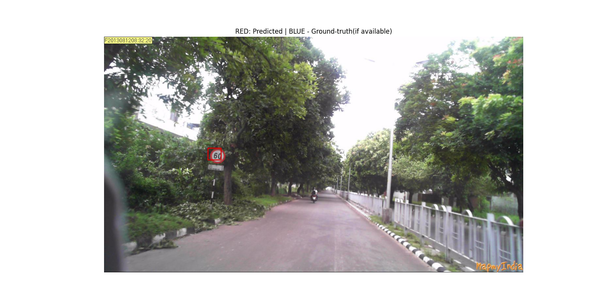
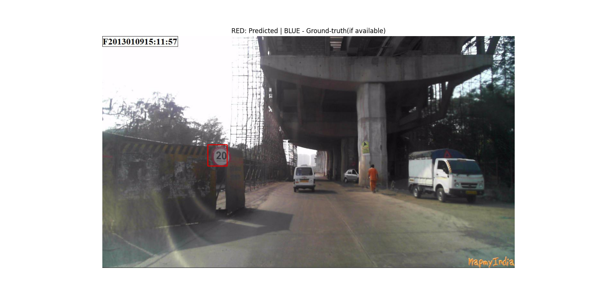
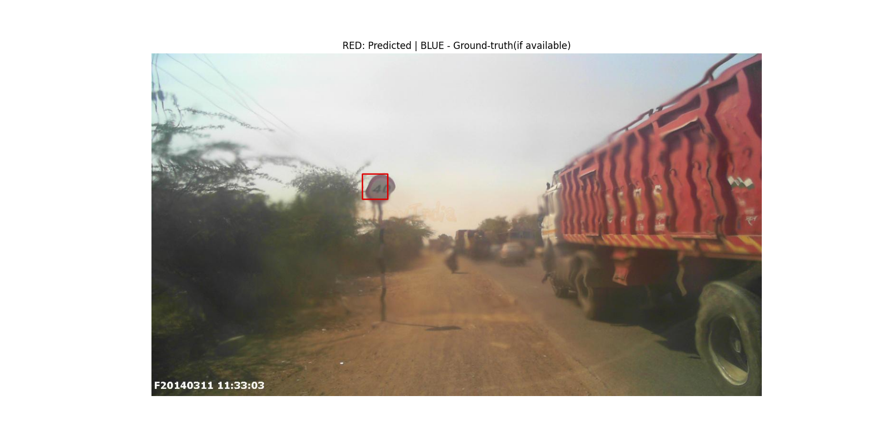
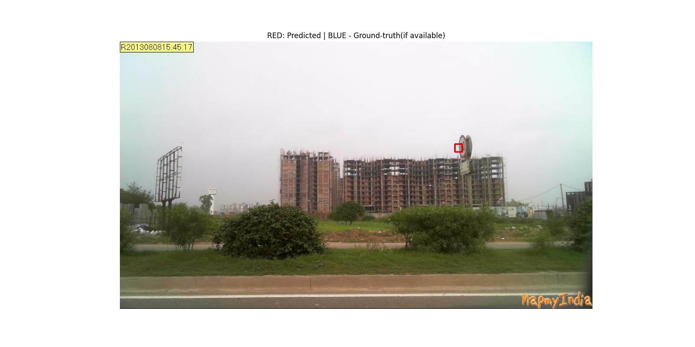
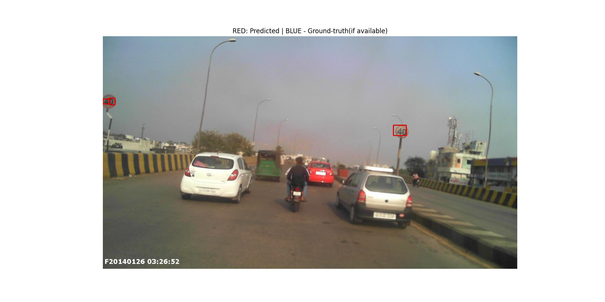

# Speed Signs detection

## Project Overview
My goal with this project was to become familiar with the CenterNet architecture for Object Detection.
It is still on-going, and I will be adding more features as time goes. 

The problem is a typical object detection problem; I am using a small Kaggle dataset (https://www.kaggle.com/c/mapmyindia2/data) where speed limit signs are identified with a bounding box, as well as a label for the associated speed limit (e.g. a max speed 80 sign would have label '80').

### Data format

    Img_Name - name of processed image
    Top - distance of label from top
    Left - distance of label from left
    Width - width of label
    Height - height of the label
    Label - label

## Baseline
The code goes through the whole model training pipeline: loading the model, visualizing data, train/dev split, preprocessing, creating a data generator, training and evaluating. 

The current version of the model is functional and able to localize the speed signs in images. Since I am building the model from the ground-up, it currently doesn't tell the difference between classes, although that is the next step.

### Baseline example prediction
Here are some predictions obtained from the model. As we can see, the model is able to succesfully detect the speed signs. The IOU between the bounding box and the ground-truth can definitely be increased, but the current performance is most likely due to the very limited number of training images. This should be easy to fix with some data augmentation and model-tuning.

The following image shows that even with heavy distortion (caused by heatwaves), the model is still able to correctly identify the speed sign. In other words, the model is somewhat robust already.

### Baseline weakpoints and edge cases
These are the cases that need to be worked on in the next steps. In the first one, the sign is rotated sideways; the model is still able to detect it, but the bounding box is barely over the sign. In the second one, we see that the smaller sign on the left is split into two boxes.

## Label classification
Label classification is currently functional. Objectness is generally good (the detector correctly sees the speed sign as an object of interest). However, performance is generally poor for the label classification and the detector outputs an almost equal probability for every speed limit. This is most likely due to the fact that the detector knows to find the signs in the image, but not to look at the written speed limit.

This could possibly be due to a lack of data, or even to the fact that the current data augmentation has a small chance of flipping the image, which would obviously result in a different speed being shown on the sign. There are a few possible things to try in order to improve this part:
1. Rather than using heatmaps to classify the signs, we could try a classical classifier (softmax classifier for N classes, where N is the number of speed limits). This technique probably has the highest chance of success. However, the downside is that it wouldn't work if there are multiple signs in the image (this isn't a multilabel classification problem, as each object has its specific category).
2. Try adding more data
3. Modify loss function to give more weight to the label classification, or even a penalty for wrong classification. This would theoretically force the model to learn to differentiate between classes.
4. Images are currently resized using letterbox transform for the input to the network. It is possible that the written speed limit information is partially lost during the downsampling, which makes classification harder. A "dumb" resizing (not keeping aspect ratio) could possibly help.

## Data augmentation
Currently, the following transforms are supported for data augmentation:
1. Random Horizontal Flip, according to a probability p
2. Random Scale, randomly sampled from a specified range
3. Random Translate, randomly sampled from a specified range
4. Random Rotate, randomly sampled from a specified range
5. Random Shear, randomly sampled from a specified range
6. Random Color Shift, randomly shifts every channel independantly according to a factor randomly sampled from a specified range
7. Resize (letterbox transform) - This is used to resize the images to the desired input size for the network

During training, transforms are randomly applied to training image. However, the current implementation shouldn't be seen as generating "new" samples, but rather as "adding noise" to the dataset at every epoch. This should probably be changed.

### TO DO
- [x] Add label classification
- [x] Data is currently very limited, so I plan on adding data augmentation
- [ ] Adding MixUp data augmentation
- [ ] Trying adversarial training for increased robustness

### References
1. https://github.com/see--/keras-centernet
2. https://www.kaggle.com/c/mapmyindia2/data
3. https://www.kaggle.com/greatgamedota/centernet-baseline-keras-training
4. https://blog.paperspace.com/data-augmentation-for-bounding-boxes/
